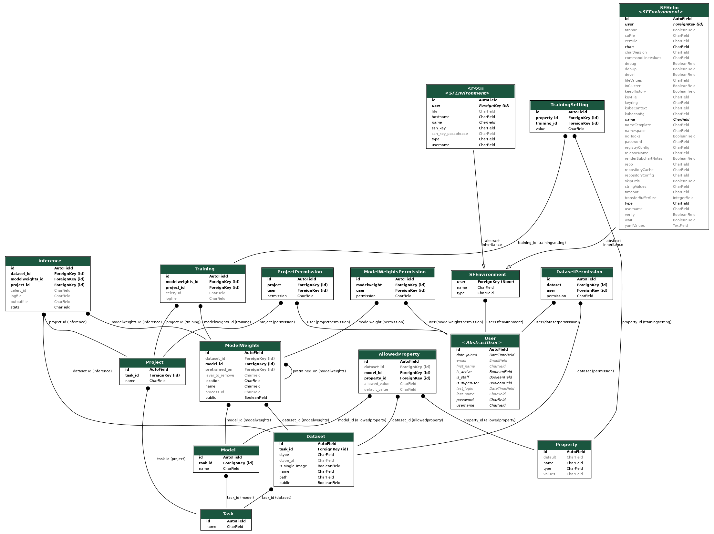
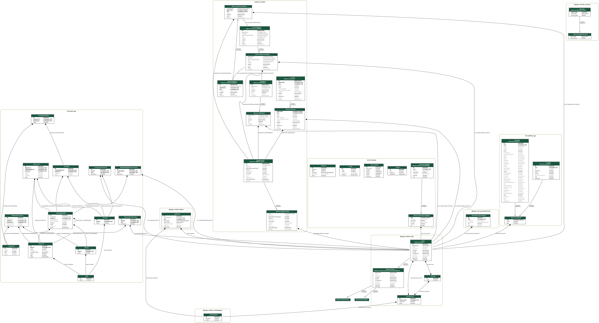

# DeepHealth Toolkit back-end

[](https://jenkins-master-deephealth-unix01.ing.unimore.it/backend/swagger)

The DeepHealth back-end interacts with the front-end, serving various APIs. It receives a configuration from the front-end then runs a deep learning pipeline based on PyECVL and PyEDDL.

API documentation: [jenkins-master-deephealth-unix01.ing.unimore.it/backend/swagger](https://jenkins-master-deephealth-unix01.ing.unimore.it/backend/swagger)

### DB schema:

<details>
<summary>Full DB schema:</summary>

</details>

## Installation

### Requirements
- Python3.6+
- git curl -- `sudo apt install git curl`
- Requirements for **PyECVL 0.10.0+** and **PyEDDL 0.14.0+**

Clone and install back-end with:

```bash
cd ~
git clone https://github.com/deephealthproject/backend.git
cd backend
virtualenv env
source env/bin/activate
pip install -r requirements.txt
chmod u+x scripts/pyecvl_install.sh
scripts/pyecvl_install.sh
```
Generate a new SECRET_KEY with:

```bash
python -c 'from django.core.management.utils import get_random_secret_key;print(get_random_secret_key())'
```

Edit the `config` file to configure the application (SECRET_KEY, DB and RabbitMQ connection and other optional Django settings).

##### Celery
Install with: `sudo apt install rabbitmq-server` 
and run the celery deamon with: `python manage.py celery`.

## First run

The back-end is a web-server based on Django, so it must be initialized like any Django project.


```bash
cd ~/backend

# Apply all the migrations
python manage.py migrate

# Creating an admin user
python manage.py createsuperuser

# Initialize Django fixtures for the DB init
# This will also download ONNX weights of the models
python scripts/init_fixtures.py

# Load fixtures into the DB (default entries)
python manage.py loaddata tasks.json property.json allowedproperty.json dataset.json model.json modelweights.json auth.json

# Start the development server
python manage.py runserver <my-server>:<my-server-port>

# Start celery
python manage.py celery
```

Read the [auth/README.md](auth_app/README.md) file for configuring the authentication backend.

## API Practice

The following table contains Postman collections for practicing with the backend.

| Collection | Postman Link |
|:---:|:---:|
| 2nd Hackathon - Pneumothorax | [](https://app.getpostman.com/run-collection/71cdc7dda0505b4be84c) |

